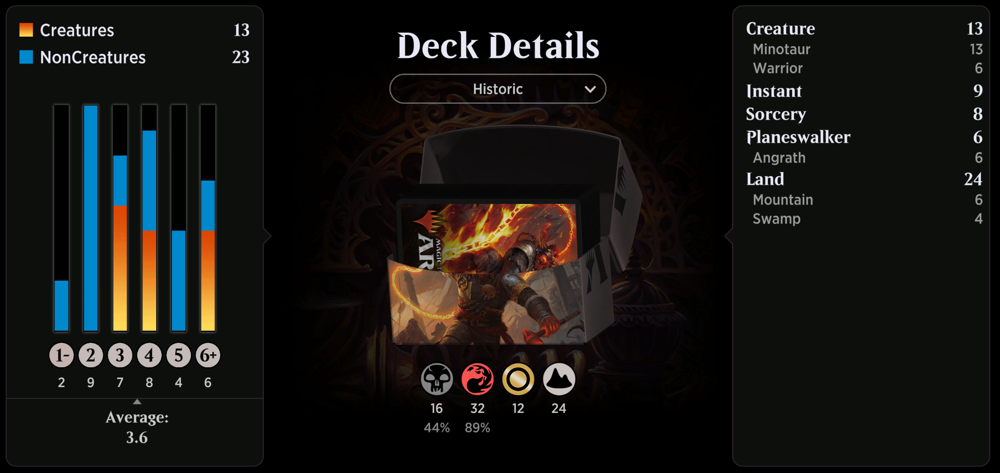

# Angrath



```
Deck
4 Angrath's Rampage (WAR) 185
6 Mountain (SLD) 106
4 Swamp (SLD) 105
4 Angrath, Captain of Chaos (WAR) 227
1 Angrath, the Flame-Chained (RIX) 152
2 Angrath's Fury (RIX) 204
1 Angrath, Minotaur Pirate (RIX) 201
2 Smelt-Ward Minotaur (GRN) 116
2 Akoum Warrior (ZNR) 134
1 Shatterskull Minotaur (ZNR) 160
2 Murder (M20) 109
4 Jaya's Greeting (WAR) 136
1 Moraug, Fury of Akoum (ZNR) 150
1 Sorin's Thirst (WAR) 104
2 Shock (M19) 156
4 Hostile Minotaur (M19) 147
2 Barren Moor (ONS) 312
1 Zof Consumption (ZNR) 132
2 Thriving Moor (JMP) 37
2 Thriving Bluff (JMP) 33
1 Song-Mad Treachery (ZNR) 165
2 Forgotten Cave (ONS) 317
2 Dragonskull Summit (XLN) 252
3 Hurloon Minotaur (ANB) 74
4 Blightstep Pathway (KHM) 252

```

### 211101
```
Deck
4 Angrath's Rampage (WAR) 185
8 Mountain (SLD) 106
6 Swamp (SLD) 105
4 Angrath, Captain of Chaos (WAR) 227
1 Angrath, the Flame-Chained (RIX) 152
2 Angrath's Fury (RIX) 204
1 Angrath, Minotaur Pirate (RIX) 201
2 Smelt-Ward Minotaur (GRN) 116
2 Akoum Warrior (ZNR) 134
1 Shatterskull Minotaur (ZNR) 160
2 Murder (M20) 109
4 Jaya's Greeting (WAR) 136
1 Moraug, Fury of Akoum (ZNR) 150
1 Sorin's Thirst (WAR) 104
2 Shock (M19) 156
4 Hostile Minotaur (M19) 147
2 Barren Moor (ONS) 312
1 Zof Consumption (ZNR) 132
2 Thriving Moor (JMP) 37
2 Thriving Bluff (JMP) 33
1 Song-Mad Treachery (ZNR) 165
2 Forgotten Cave (ONS) 317
2 Dragonskull Summit (XLN) 252
3 Hurloon Minotaur (ANB) 74

Sideboard

```

### 201207
```
Deck
2 Angrath, Captain of Chaos (WAR) 227
8 Swamp (UST) 214
4 Angrath's Rampage (WAR) 185
10 Mountain (UST) 215
1 Angrath, the Flame-Chained (RIX) 152
1 Angrath, Minotaur Pirate (RIX) 201
2 Angrath's Fury (RIX) 204
2 Dire Fleet Neckbreaker (RIX) 156
4 Rigging Runner (XLN) 157
1 Shock (M21) 159
2 Kitesail Freebooter (XLN) 110
2 Fiery Cannonade (XLN) 143
2 Jaya's Greeting (WAR) 136
1 Headstrong Brute (XLN) 147
2 Lightning-Rig Crew (XLN) 150
2 Murder (M20) 109
1 Dire Fleet Interloper (XLN) 103
1 Brazen Buccaneers (XLN) 134
2 Brazen Freebooter (RIX) 95
2 Captivating Crew (XLN) 137
1 Barren Moor (ONS) 312
1 Zof Consumption (ZNR) 132
1 Thriving Bluff (JMP) 33
1 Song-Mad Treachery (ZNR) 165
1 Forgotten Cave (ONS) 317
2 Dragonskull Summit (XLN) 252
1 Thriving Moor (JMP) 37

Sideboard

```


### 201206
```
Deck
4 Nyxborn Marauder (THB) 109
11 Mountain (UST) 215
4 Rage-Scarred Berserker (THB) 113
4 Hostile Minotaur (M19) 147
12 Swamp (UST) 214
4 Barging Sergeant (GRN) 92
4 Murder (M20) 109
4 Jaya's Greeting (WAR) 136
4 Act of Treason (M20) 124
4 Sorin's Thirst (WAR) 104
4 Angrath, Captain of Chaos (WAR) 227
1 Akoum Warrior (ZNR) 134

Sideboard

```

