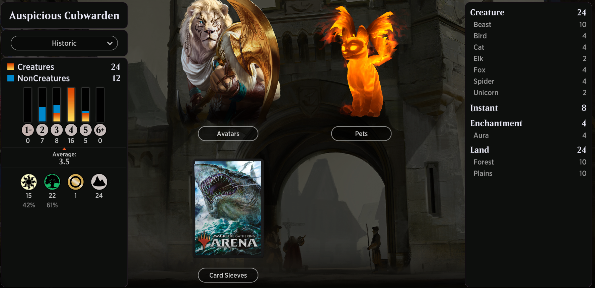

# Auspicious Cubwarden

<table style="background-color:black;">
    <tr>
        <td>
            
        </td>
    </tr>
</table> 

# 220710
```
Deck
4 Cubwarden (IKO) 7
12 Forest (UST) 216
4 Vulpikeet (IKO) 37
2 Majestic Auricorn (IKO) 22
4 Glowstone Recluse (IKO) 156
12 Plains (UST) 212
2 Gemrazer (IKO) 155
2 Migratory Greathorn (IKO) 165
2 Auspicious Starrix (IKO) 144
4 Pacifism (M20) 32
2 Root Snare (RNA) 137
1 Pulse of Murasa (M20) 189
4 Mysterious Egg (IKO) 3
2 Join Shields (GRN) 181
1 Appeal /// Authority (AKR) 227
2 Mirari's Wake (JUD) 139
```

## 210130
```
Deck
4 Cubwarden (IKO) 7
9 Plains (UST) 212
4 Vulpikeet (IKO) 37
2 Majestic Auricorn (IKO) 22
4 Glowstone Recluse (IKO) 156
7 Forest (UST) 216
2 Gemrazer (IKO) 155
2 Migratory Greathorn (IKO) 165
2 Auspicious Starrix (IKO) 144
4 Pacifism (M20) 32
2 Secluded Steppe (ONS) 324
2 Root Snare (RNA) 137
1 Temple of Plenty (THB) 248
2 Sunpetal Grove (XLN) 257
1 Tranquil Thicket (ONS) 326
1 Castle Garenbrig (ELD) 240
1 Pulse of Murasa (M20) 189
4 Mysterious Egg (IKO) 3
1 Temple of Malady (M20) 254
2 Join Shields (GRN) 181
1 Appeal /// Authority (AKR) 227
2 Mirari's Wake (JUD) 139
```

## 210127
```
Deck
4 Cubwarden (IKO) 7
5 Forest (UST) 216
4 Vulpikeet (IKO) 37
2 Majestic Auricorn (IKO) 22
4 Glowstone Recluse (IKO) 156
8 Plains (UST) 212
2 Gemrazer (IKO) 155
2 Migratory Greathorn (IKO) 165
2 Auspicious Starrix (IKO) 144
4 Pacifism (M20) 32
2 Secluded Steppe (ONS) 324
2 Root Snare (RNA) 137
2 Temple of Plenty (THB) 248
2 Sunpetal Grove (XLN) 257
2 Tranquil Thicket (ONS) 326
1 Castle Garenbrig (ELD) 240
1 Pulse of Murasa (M20) 189
4 Mysterious Egg (IKO) 3
2 Temple of Malady (M20) 254
2 Join Shields (GRN) 181
1 Appeal /// Authority (AKR) 227
2 Mirari's Wake (JUD) 139
```