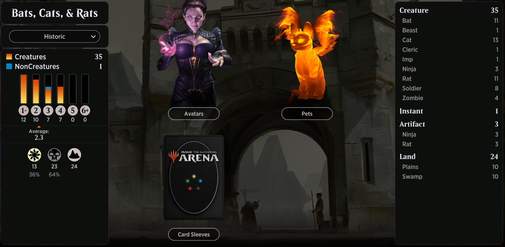

# Bats, Cats, & Rats

<table style="background-color:black;">
    <tr>
        <td>
            
        </td>
    </tr>
</table> 

# 220710
```
Deck
10 Plains (UST) 212
10 Swamp (UST) 214
1 Blight Keeper (XLN) 92
2 Ghastly Gloomhunter (ZNR) 103
2 Ajani's Pridemate (WAR) 4
4 Leonin Vanguard (M19) 22
2 Leonin Warleader (M19) 23
4 Typhoid Rats (ANB) 63
1 Pack Rat (RTR) 73
1 Murder (M20) 109
4 Brightclimb Pathway (ZNR) 259
3 Sacred Cat (AKR) 34
1 Leonin Sanctifier (J21) 4
1 Prowling Felidar (ZNR) 34
2 Blighted Bat (JMP) 205
2 Malakir Familiar (JMP) 253
2 Burglar Rat (GRN) 64
1 Plaguecrafter's Familiar (J21) 18
2 Mukotai Ambusher (NEO) 112
2 Courier Bat (VOW) 102
2 Bloodhunter Bat (JMP) 210
1 Nezumi Prowler (NEO) 116
```

## 220709
```
Deck
10 Plains (UST) 212
10 Swamp (UST) 214
1 Blight Keeper (XLN) 92
2 Ghastly Gloomhunter (ZNR) 103
2 Ajani's Pridemate (WAR) 4
4 Leonin Vanguard (M19) 22
2 Leonin Warleader (M19) 23
2 Typhoid Rats (ANB) 63
2 Pack Rat (RTR) 73
1 Murder (M20) 109
4 Brightclimb Pathway (ZNR) 259
4 Charmed Stray (WAR) 8
2 Leonin Sanctifier (J21) 4
2 Prowling Felidar (ZNR) 34
2 Blighted Bat (JMP) 205
2 Malakir Familiar (JMP) 253
4 Burglar Rat (GRN) 64
2 Plaguecrafter's Familiar (J21) 18
2 Dirge Bat (IKO) 84
```

## 210930
```
Deck
4 Regal Bloodlord (M19) 222
12 Swamp (UST) 214
12 Plains (UST) 212
1 Blight Keeper (XLN) 92
2 Ghastly Gloomhunter (ZNR) 103
2 Malakir Familiar (JMP) 253
2 Bartizan Bats (GRN) 62
2 Bloodhunter Bat (JMP) 210
2 Dirge Bat (IKO) 84
2 Ajani's Pridemate (WAR) 4
2 Basri's Acolyte (M21) 8
4 Leonin Vanguard (M19) 22
2 Cubwarden (IKO) 7
2 Leonin Warleader (M19) 23
2 Typhoid Rats (ANB) 63
2 Pack Rat (RTR) 73
4 Murder (M20) 109
1 Pacifism (JMP) 125
```