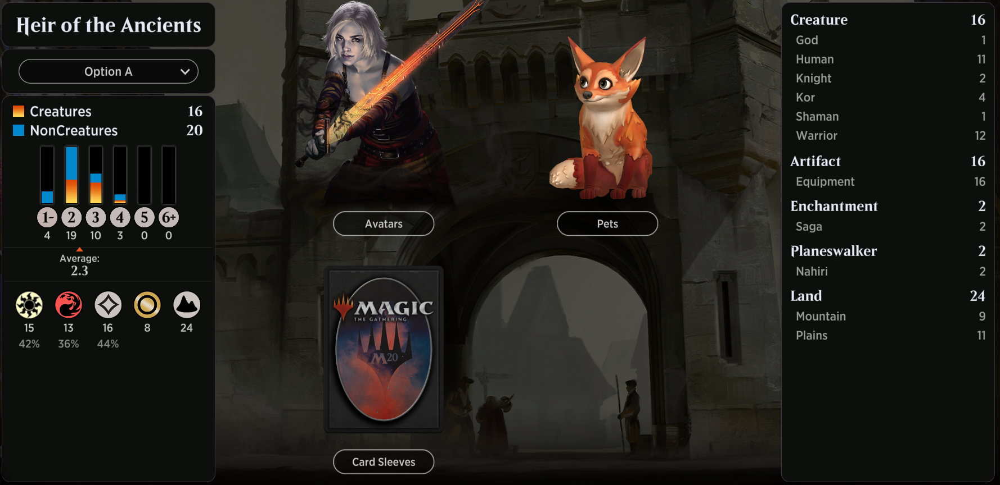

# Heir of the Ancients

<table style="background-color:black;">
    <tr>
        <td>
            
        </td>
    </tr>
</table> 

# 220715
```
Deck
9 Mountain (UST) 215
11 Plains (UST) 212
2 Danitha Capashen, Paragon (DAR) 12
4 Champion of the Flame (DAR) 116
1 Valduk, Keeper of the Flame (DAR) 148
2 Forging the Tyrite Sword (KHM) 211
4 Short Sword (M21) 236
3 Cobbled Wings (XLN) 233
4 Goldvein Pick (KHM) 239
4 Jousting Lance (DAR) 221
1 Forebear's Blade (DAR) 214
2 A-Nahiri, Heir of the Ancients (ZNR) 230
4 A-Kargan Warleader (ZNR) 224
4 Kor Blademaster (ZNR) 21
4 Needleverge Pathway (ZNR) 263
1 Halvar, God of Battle (KHM) 15
```

# 220714
```
Deck
11 Plains (UST) 212
9 Mountain (UST) 215
2 Danitha Capashen, Paragon (DAR) 12
4 Champion of the Flame (DAR) 116
1 Valduk, Keeper of the Flame (DAR) 148
2 Forging the Tyrite Sword (KHM) 211
4 Short Sword (M21) 236
4 Cobbled Wings (XLN) 233
4 Goldvein Pick (KHM) 239
4 Jousting Lance (DAR) 221
1 Forebear's Blade (DAR) 214
2 A-Nahiri, Heir of the Ancients (ZNR) 230
4 A-Kargan Warleader (ZNR) 224
4 Kor Blademaster (ZNR) 21
4 Needleverge Pathway (ZNR) 263
```

## 220513
```
Deck
11 Plains (UST) 212
9 Mountain (UST) 215
2 Danitha Capashen, Paragon (DAR) 12
4 Champion of the Flame (DAR) 116
1 Valduk, Keeper of the Flame (DAR) 148
2 Forging the Tyrite Sword (KHM) 211
4 Short Sword (M21) 236
4 Cobbled Wings (XLN) 233
4 Goldvein Pick (KHM) 239
4 Jousting Lance (DAR) 221
1 Forebear's Blade (DAR) 214
2 Nahiri, Heir of the Ancients (ZNR) 230
4 Kargan Warleader (ZNR) 224
4 Kor Blademaster (ZNR) 21
4 Needleverge Pathway (ZNR) 263
```

## 210715
```
Deck
13 Plains (UST) 212
11 Mountain (UST) 215
2 Danitha Capashen, Paragon (DAR) 12
4 Champion of the Flame (DAR) 116
1 Valduk, Keeper of the Flame (DAR) 148
2 Forging the Tyrite Sword (KHM) 211
4 Short Sword (M21) 236
4 Cobbled Wings (XLN) 233
4 Goldvein Pick (KHM) 239
4 Jousting Lance (DAR) 221
1 Forebear's Blade (DAR) 214
2 Nahiri, Heir of the Ancients (ZNR) 230
4 Kargan Warleader (ZNR) 224
4 Kor Blademaster (ZNR) 21
```